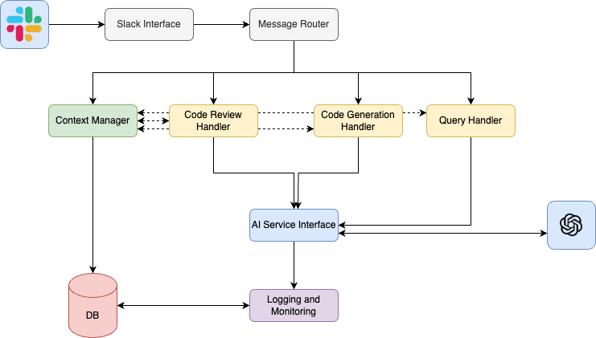

# ConsultAIng Bot: High-Level Architecture Summary

## Overview

The ConsultAIng bot is designed as a modular, scalable system that integrates with Slack to provide AI-powered code review, code generation, and programming assistance. The architecture is composed of several key components that work together to process user requests and deliver responses.

## Key Components

1. **Slack Interface**
   - Primary point of interaction for users
   - Handles incoming messages and commands from Slack
   - Sends responses back to Slack channels or direct messages

2. **Message Router**
   - Analyzes incoming requests and directs them to appropriate handlers
   - Enables easy addition of new functionalities without modifying the Slack interface

3. **Context Manager**
   - Manages project-specific and user-specific contexts
   - Provides relevant context to other components for personalized responses

4. **Code Review Handler**
   - Processes code review requests
   - Utilizes the AI Service for code analysis and feedback generation

5. **Code Generation Handler**
   - Handles code generation requests
   - Interfaces with the AI Service to create code based on user specifications

6. **Query Handler**
   - Manages general programming queries
   - Leverages the AI Service to provide informative responses

7. **AI Service Interface**
   - Centralizes communication with OpenAI's API
   - Formats requests and parses responses for all AI-dependent operations

8. **Database**
   - Stores user and project contexts
   - Potentially caches frequent queries for improved response times

9. **Logging and Monitoring Service**
   - Tracks system performance, usage metrics, and errors
   - Provides data for system improvement and debugging

## Data Flow

1. User interacts with the bot via Slack
2. Slack Interface receives the message and passes it to the Message Router
3. Message Router determines the type of request and directs it to the appropriate handler
4. The handler processes the request, consulting the Context Manager and AI Service Interface as needed
5. AI Service Interface communicates with OpenAI's API
6. The handler formulates a response
7. The response is sent back through the Slack Interface to the user

## Key Architectural Decisions

1. **Modular Design**: Separating concerns into distinct components allows for easier maintenance and future enhancements.
2. **Centralized AI Interface**: All AI operations go through a single interface, simplifying API management and potential future AI provider changes.
3. **Context-Aware Processing**: The Context Manager allows for personalized responses based on project or user-specific information.
4. **Extensibility**: The Message Router architecture allows for easy addition of new features and request types.

## Scalability and Performance Considerations

- The modular design allows for individual scaling of components as needed.
- Caching frequently asked questions or generated code snippets can improve response times.
- The Logging and Monitoring Service enables performance tracking and optimization.

## Security Considerations

- All external communications (Slack and OpenAI) should be encrypted.
- The Database should be secured and regularly backed up.
- User data and submitted code should be handled according to privacy regulations.

## Future Expansion

This architecture is designed to accommodate future enhancements, such as:
- Integration with version control systems
- Support for additional AI models or services
- Implementation of more sophisticated caching mechanisms
- Addition of new types of code analysis or generation features

By maintaining a modular and extensible design, the ConsultAIng bot can evolve to meet changing user needs and incorporate new technologies as they become available.

# High Level Architecture Diagram

